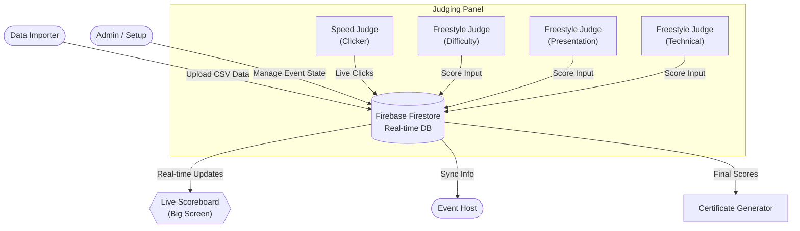

# GBRSA SupaApp - Competition Judging System

> **The all-in-one platform for managing GBRSA Rope Skipping competitions.**

This web application streamlines the entire workflow of a rope skipping event, from participant management to real-time judging and final results. It replaces paper-based scoring with a live, cloud-synchronized system.

## 🌟 System Workflow

The following diagram illustrates how data flows through the system during an event:

## 🚀 Key Capabilities

### 1. Centralized Event Management
-   **CSV Import**: Easily upload participant lists, divisions, and team data.
-   **Event Control**: Admins can Open/Close lanes, reset scores, and manage the schedule live.

### 2. Specialized Judging Interfaces
The app provides custom interfaces tailored to each judging role:
-   **Speed Judging**: A large touch-optimized "Clicker" interface for counting jumps.
-   **Freestyle Judging**: Complex scoring forms for Difficulty, Presentation, Required Elements, and Technical judging.
-   **Station Logic**: Judges login with a unique **Station Key** and are automatically routed to their assigned lane and role.

### 3. Live Audience Experience
-   **Live Scoreboard**: A dedicated view for projectors/big screens that updates instantly as judges tap their screens. Show the audience the scores *as they happen*.
-   **Host View**: Gives the MC/Announcer real-time info on who is competing and their current standing.

### 4. Results & Rewards
-   **Automated Ranking**: The system calculates winners based on GBRSA rules.
-   **Certificates**: Generate and print PDF certificates for winners directly from the app.

---

## 🔑 Login Access Keys

The system uses a **Key-Based Authentication** system. Authorized personnel are issued unique access codes to enter their specific workspace.

| Role | Function |
| :--- | :--- |
| **Speed Judge** | Counts jumps using a digital clicker. |
| **Difficulty Judge** | Scores the level of difficulty for freestyle routines. |
| **Technical Judge** | Monitors technical execution and violations. |
| **Presentation Judge** | Scores the artistic presentation and performance. |
| **Required Elements** | Checks for mandatory routine components. |
| **Admin** | Full system access to manage event data. |
| **Live Board** | Read-only view for the big screen. |
